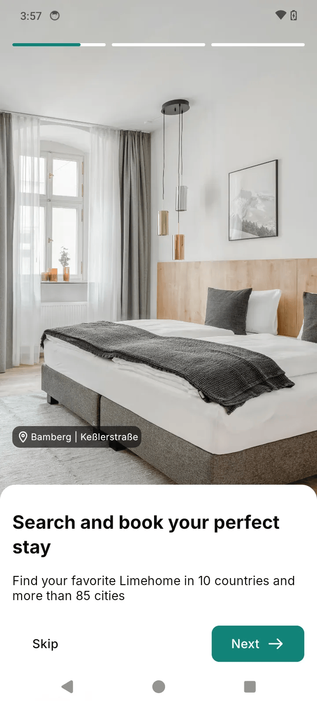

# 🏨 Limehome - Compose Multiplatform
Limehome is a premium Kotlin Multiplatform (KMP) mobile application targeting Android and iOS. It provides a seamless property search and booking experience, featuring a modern UI built with **Compose Multiplatform** and **Material 3**.

## 📱 App Demo
<p align="center">
  
</p>

## 📱 Features & Core Screens

### 1. ✨ Entry & Onboarding
*   **Visual Splash Screen**: A smooth entry point for the application.
*   **Interactive Onboarding**: Guides new users through the app's value proposition with options to sign up or explore as a guest.

### 2. 🔐 Authentication
*   **Login Flow**: Secure login interface to personalize the user experience and manage bookings.
*   **Session State**: Tracks login status and user information across the application.

### 3. 🏠 Smart Home Dashboard
*   **Property Highlights**: Browse curated property listings with details like city, street, and special badges.
*   **Quick Actions**: Easy access to search, support, and settings directly from the home screen.

### 4. 🔍 Property Search & Selection
*   **Search Engine**: Find properties by city and number of guests.
*   **Property Selection**: View a list of available properties based on search criteria.
*   **Detailed Insights**: Deep dive into specific property details, including high-quality imagery and location information.

### 5. ⚙️ User Preferences & Settings
*   **Language Settings**: Support for multiple languages with a dedicated selection interface.
*   **Notification Management**: Toggle and customize app notifications.

### 6. 📩 Support & Feedback
*   **Help Center**: Integrated support screen for user assistance.
*   **Feedback System**: A dedicated channel for users to provide suggestions and report issues.

## 🛠️ Architecture & Tech Stack
The application leverages modern Kotlin Multiplatform architecture:

| Component | Library / Framework | Description |
| :--- | :--- | :--- |
| **UI Framework** | Compose Multiplatform | Declarative shared UI for Android and iOS. |
| **Design System** | Material 3 | Modern, accessible UI components. |
| **Lifecycle** | AndroidX Lifecycle | Shared ViewModels and lifecycle-aware components. |
| **Language** | Kotlin | 100% Kotlin codebase across all layers. |

## 🚀 How to Run the Applications

### Prerequisites
*   **macOS** (Required for iOS compilation)
*   **Android Studio** / **IntelliJ IDEA** with KMP plugin
*   **Xcode** 15+
*   **JDK** 17+

### 🤖 Running the Android App
1.  Open the project in Android Studio.
2.  Select `androidApp` in the run configuration selector.
3.  Click **Run** or use:
    ```bash
    ./gradlew :androidApp:installDebug
    ```

### 🍎 Running the iOS App
1.  Navigate to the `iosApp` folder.
2.  Open `iosApp.xcworkspace` in Xcode.
3.  Select your target simulator/device and press **⌘ + R**.

## 📂 Project Structure
```text
.
├── androidApp/          # Android-specific entry point
├── iosApp/              # iOS-specific Xcode project & SwiftUI wrapper
├── shared/              # Shared KMP codebase
│   └── src/
│       ├── commonMain/  # Shared UI (Compose), screens, and logic
│       │   └── kotlin/com/pax/limehome/
│       │       ├── screens/    # UI Screen definitions
│       │       ├── components/ # Reusable UI components
│       │       ├── theme/      # Material 3 Design System
│       │       └── network/    # Data & Networking logic
│       ├── androidMain/ # Android-specific implementations
│       └── iosMain/     # iOS-specific implementations
└── build.gradle.kts     # Main multiplatform build script
```

---
*Developed with ❤️ using Kotlin Multiplatform.*
